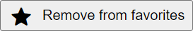

# Svelte Material Symbols
Small package for convenient usage [Google Material Symbols](https://fonts.google.com/icons) in your Svelte project.

## Installation

**npm:**

```bash
npm i svelte-material-symbols
```

## Usage

For avoid hardcoding icon names, I recommend using `google-icon-names` package:

```bash
npm i google-icon-names
```

Google icons require special fonts to work, so you can add them to your `app.html` manually or just use `<HeadLinks />` component provided by package.

Finally, implementation in your project may look like:

```jsx
// <Your component>.svelte
<script>
    import { HeadLinks, MaterialSymbol } from 'svelte-material-symbols';
    import { msStar } from 'google-icon-names';
</script>

<HeadLinks />
<button style="display: flex; align-items: center; gap: 8px">
    <MaterialSymbol name={msStar} type="rounded" filled />
    Remove from favorites
</button>

```

This gives:


